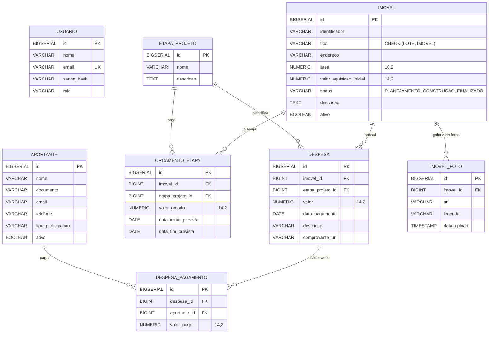

# Modelo de Dados — Gestão de Custos de Obras

Este documento descreve o esquema de banco de dados relacional (PostgreSQL) do sistema, gerenciado via migrações versionadas pelo **Flyway** (`src/main/resources/db/migration/`).

---

## 1. Diagrama Entidade-Relacionamento (ER)

---

## 2. Detalhes das Tabelas

### `usuario`
Tabela para autenticação e gestão de usuários do sistema (RNF01).
- `id` (BIGSERIAL, PK): Identificador único.
- `nome` (VARCHAR(150), NOT NULL): Nome do usuário.
- `email` (VARCHAR(150), UNIQUE, NOT NULL): E-mail de acesso.
- `senha_hash` (VARCHAR(255), NOT NULL): Hash da senha.
- `role` (VARCHAR(30), NOT NULL, DEFAULT 'ADMIN'): Perfil de permissão (`ADMIN`, `USER`).

### `imovel`
Cadastro das propriedades/lotes que recebem obras e investimentos (RF01).
- `id` (BIGSERIAL, PK): Identificador único.
- `identificador` (VARCHAR(50), NOT NULL): Código/nome do lote ou imóvel.
- `tipo` (VARCHAR(20), NOT NULL): Enum (`LOTE`, `IMOVEL`).
- `endereco` (VARCHAR(255)): Endereço físico.
- `area` (NUMERIC(10,2)): Área em metros quadrados (m²).
- `valor_aquisicao_inicial` (NUMERIC(14,2)): Custo inicial de compra.
- `status` (VARCHAR(20), NOT NULL, DEFAULT 'PLANEJAMENTO'): Enum (`PLANEJAMENTO`, `CONSTRUCAO`, `FINALIZADO`).
- `descricao` (TEXT): Observações gerais.
- `ativo` (BOOLEAN, NOT NULL, DEFAULT true): Flag de soft delete.

### `aportante`
Cadastro de sócios, investidores e proprietários que aportam recursos (RF02).
- `id` (BIGSERIAL, PK): Identificador único.
- `nome` (VARCHAR(150), NOT NULL): Nome completo ou razão social.
- `documento` (VARCHAR(20)): CPF ou CNPJ.
- `email` (VARCHAR(150)): E-mail de contato.
- `telefone` (VARCHAR(20)): Telefone.
- `tipo_participacao` (VARCHAR(50), NOT NULL): Ex: Sócio, Investidor.
- `ativo` (BOOLEAN, NOT NULL, DEFAULT true): Flag de soft delete.

### `etapa_projeto`
Catálogo global reutilizável de fases construtivas (RF03).
- `id` (BIGSERIAL, PK): Identificador único.
- `nome` (VARCHAR(100), NOT NULL): Ex: Fundação, Alvenaria, Acabamento.
- `descricao` (TEXT): Descrição dos serviços da etapa.

### `orcamento_etapa`
Planejamento financeiro e cronograma previsto por imóvel e etapa (MVP — Orçado vs Realizado).
- `id` (BIGSERIAL, PK): Identificador único.
- `imovel_id` (BIGINT, FK -> `imovel.id`, NOT NULL): Imóvel orçado.
- `etapa_projeto_id` (BIGINT, FK -> `etapa_projeto.id`, NOT NULL): Etapa correspondente.
- `valor_orcado` (NUMERIC(14,2), NOT NULL): Custo limite orçado.
- `data_inicio_prevista` (DATE): Previsão de início da etapa no imóvel.
- `data_fim_prevista` (DATE): Previsão de término da etapa no imóvel.
- **Restrição**: `UNIQUE(imovel_id, etapa_projeto_id)` — cada etapa só é orçada uma vez por imóvel.

### `despesa`
Lançamento de custos vinculados a um imóvel e etapa (RF04).
- `id` (BIGSERIAL, PK): Identificador único.
- `imovel_id` (BIGINT, FK -> `imovel.id`, NOT NULL): Imóvel associado.
- `etapa_projeto_id` (BIGINT, FK -> `etapa_projeto.id`, NOT NULL): Etapa associada.
- `valor` (NUMERIC(14,2), NOT NULL): Valor total da despesa.
- `data_pagamento` (DATE, NOT NULL): Data da realização do pagamento.
- `descricao` (VARCHAR(255)): Descrição do material/serviço.
- `comprovante_url` (VARCHAR(500)): Link/caminho do comprovante.

### `despesa_pagamento`
Detalhamento de quem pagou a despesa (rateio entre aportantes).
- `id` (BIGSERIAL, PK): Identificador único.
- `despesa_id` (BIGINT, FK -> `despesa.id`, NOT NULL, ON DELETE CASCADE): Despesa mãe.
- `aportante_id` (BIGINT, FK -> `aportante.id`, NOT NULL, ON DELETE RESTRICT): Aportante pagador.
- `valor_pago` (NUMERIC(14,2), NOT NULL): Valor pago por este aportante.
- **Validação de Negócio**: `SUM(valor_pago)` <= `despesa.valor`.
