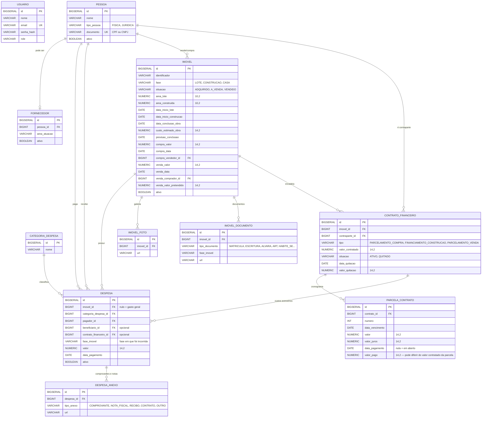

# Modelo de Dados

Schema PostgreSQL gerido pelo Hibernate enquanto o Flyway estiver pausado
(ADR-013/029). Para os campos exatos de cada tabela, ver o `Model.java` do
domínio — não duplicado aqui de propósito.

Este é o modelo **alvo** do reescopo de Ago 2026 (ADR-019 a ADR-029); a
implementação avança por fases.

## Diagrama ER

## Regras que não estão óbvias só olhando o schema

- `despesa.imovel_id` **nulo é intencional**: gasto geral (contador, combustível,
  ferramentas) que não entra no custo de nenhum imóvel (ADR-023)
- `despesa.fase_imovel` guarda a fase **em que a despesa foi incorrida**, não a
  fase atual do imóvel — é o que faz lançamento retroativo cair no lugar certo
- `imovel.fase` só avança; as três datas de transição são gravadas
  automaticamente e não podem ser reconstruídas depois (ADR-020)
- `contrato_financeiro.valor_quitacao` é o valor **negociado** da quitação
  antecipada, independente da soma das parcelas em aberto — e quitar não altera
  os valores originais das parcelas (ADR-025)
- A soma das parcelas **pode exceder** `valor_contratado` legitimamente (juros);
  não existe validação disso
- FKs para `pessoa` em relações financeiras: `ON DELETE RESTRICT`, e soft delete
  (`ativo`) em `imovel`, `pessoa`, `fornecedor` e `despesa` (ADR-028)
- Regras de negócio que não são constraint de banco (regra de custo, transições
  de fase) estão em `.agents/rules/`, que carregam sozinhas no escopo delas
