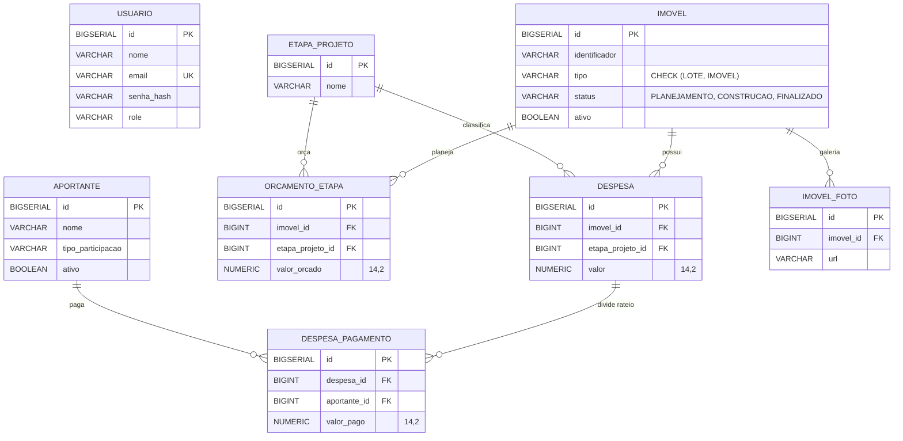

# Modelo de Dados

Schema PostgreSQL gerenciado via Flyway (`src/main/resources/db/migration/`).
Para os campos exatos de cada tabela, ver a migration correspondente ou o
`Model.java` do domínio — não duplicado aqui de propósito.

## Diagrama ER

## Regras que não estão óbvias só olhando o schema

- `despesa_pagamento.aportante_id` → `ON DELETE RESTRICT`: impede apagar um
  aportante que já tem pagamento registrado (RNF02)
- `orcamento_etapa`: `UNIQUE(imovel_id, etapa_projeto_id)` — cada etapa só é
  orçada uma vez por imóvel
- Validação de negócio (não é constraint de banco, é no service):
  `SUM(despesa_pagamento.valor_pago) <= despesa.valor` — ver ADR-006 em
  `docs/DECISOES.md`
