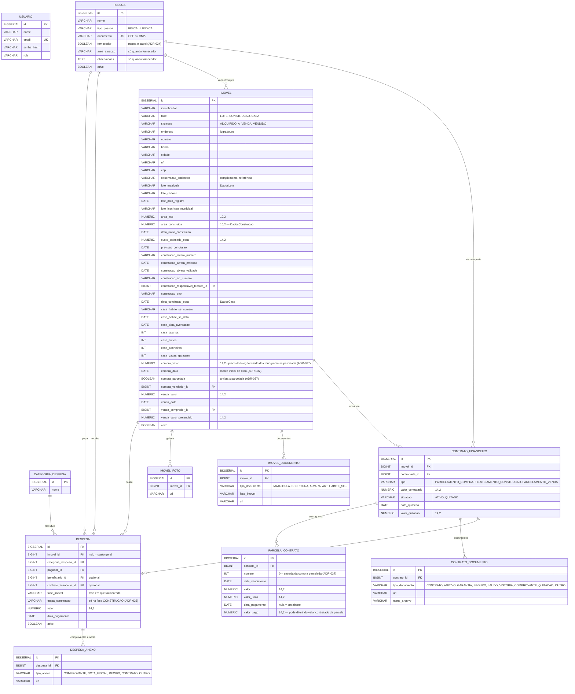

# Modelo de Dados

Schema PostgreSQL gerido pelo Hibernate enquanto o Flyway estiver pausado
(ADR-013/029). Para os campos exatos de cada tabela, ver o `Model.java` do
domínio — não duplicado aqui de propósito.

Este é o modelo **alvo** do reescopo de Ago 2026 (ADR-019 a ADR-029); a
implementação avança por fases.

## Diagrama ER

## Regras que não estão óbvias só olhando o schema

- **Não existe mais tabela `fornecedor`** (ADR-034): o papel virou
  `pessoa.fornecedor`, com `area_atuacao` e `observacoes` preenchidos só quando a
  marca está ligada. Com o Flyway pausado, o `DROP TABLE` da tabela antiga está no
  script manual `backend/src/main/resources/db/manual/2026-08-migrar-fornecedor-para-pessoa.sql`
- **`despesa.etapa_construcao` é opcional e condicionada à fase**: o service
  recusa etapa em despesa cuja `fase_imovel` não seja `CONSTRUCAO` (ADR-035). Ela
  não participa de nenhum cálculo de custo — só do quadro por etapa do relatório

- `despesa.imovel_id` **nulo é intencional**: gasto geral (contador, combustível,
  ferramentas) que não entra no custo de nenhum imóvel (ADR-023)
- `despesa.fase_imovel` guarda a fase **em que a despesa foi incorrida**, não a
  fase atual do imóvel — é o que faz lançamento retroativo cair no lugar certo
- `imovel.fase` só avança; as datas de transição são **informadas pelo usuário**
  na ação de transição — nunca gravadas automaticamente — e não podem ser
  reconstruídas depois (ADR-020)
- `imovel.compra_data` é o **marco inicial** da carteira e da fase LOTE; não
  existe `data_inicio_lote` separada (ADR-032)
- **Na compra parcelada, `imovel.compra_valor` é gravado pelo contrato**, não pelo
  cadastro (ADR-037): o preço à vista informado ou `entrada + Σ parcelas`. Nunca é
  sobrescrito depois, nem ao editar o cronograma
- **`parcela_contrato.numero = 0` é a entrada** da compra parcelada, criada já com
  `data_pagamento` e `valor_pago`. As prestações começam em 1
- As colunas com prefixo `lote_`, `construcao_` e `casa_` são os `@Embedded`
  `DadosLote`/`DadosConstrucao`/`DadosCasa` (ADR-031) — agrupamento lógico numa
  tabela só, sem tabela por fase. Nulos nas fases ainda não atingidas são
  esperados, e nenhum desses campos é obrigatório na transição
- O endereço fica todo na raiz, no formato convencional (logradouro, número,
  bairro, cidade, UF, CEP e uma observação livre), porque vale para o imóvel
  inteiro e não muda quando a fase avança
- `contrato_financeiro.valor_quitacao` é o valor **negociado** da quitação
  antecipada, independente da soma das parcelas em aberto — e quitar não altera
  os valores originais das parcelas (ADR-025)
- A soma das parcelas **pode exceder** `valor_contratado` legitimamente (juros);
  não existe validação disso
- FKs para `pessoa` em relações financeiras: `ON DELETE RESTRICT`, e soft delete
  (`ativo`) em `imovel`, `pessoa` e `despesa` (ADR-028)
- Regras de negócio que não são constraint de banco (regra de custo, transições
  de fase) estão em `.agents/rules/`, que carregam sozinhas no escopo delas
